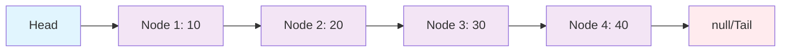

# Day 1: Data Structures - Custom Linked List Implementation

## Concept Explanation

Data structures are specialized formats for organizing, processing, retrieving, and storing data. Understanding how to implement them from scratch gives you deep insight into how they work internally and helps you choose the right tool for the job.

### What is a Linked List?

A **Linked List** is a linear data structure where elements are stored in nodes, and each node contains data and a reference (link) to the next node in the sequence. Unlike arrays, linked lists don't require contiguous memory allocation.

#### Visual Representation



#### Key Components:
- **Node**: Contains data and a reference to the next node
- **Head**: Reference to the first node in the list
- **Tail**: Reference to the last node in the list
- **Size**: Number of nodes in the list

#### Types of Linked Lists:
- **Singly Linked List**: Each node points only to the next node
- **Doubly Linked List**: Each node points to both next and previous nodes
- **Circular Linked List**: Last node points back to the first node

#### Performance Characteristics:
- **Access**: O(n) - Must traverse from head to find element
- **Insertion**: O(1) at beginning, O(n) at end or specific position
- **Deletion**: O(1) at beginning, O(n) at end or specific position
- **Search**: O(n) - Must traverse the list

### Why Learn Linked Lists?

1. **Memory Efficiency**: Dynamic memory allocation
2. **Flexible Size**: Can grow and shrink as needed
3. **Efficient Insertions/Deletions**: No need to shift elements
4. **Foundation for Other Structures**: Stacks, queues, and graphs use linked lists
5. **Interview Preparation**: Common coding interview topic

## Exercise: Custom Linked List Implementation

**Problem**: Implement a complete singly linked list data structure from scratch with all basic operations.

**Learning Objectives**:
- Understand how linked lists work internally
- Implement basic data structure operations
- Handle edge cases and error scenarios
- Practice object-oriented programming
- Learn memory management and references

**Requirements**:

### 1. Node Class
- `data`: Store the element value
- `next`: Reference to the next node
- Constructor to initialize a node

### 2. LinkedList Class
- `head`: Reference to the first node
- `size`: Track the number of elements
- Constructor to initialize an empty list

### 3. Required Methods
- `add(data)`: Add element to the end of the list
- `addAt(index, data)`: Add element at specific index
- `remove(data)`: Remove first occurrence of data
- `get(index)`: Get element at specific index
- `size()`: Return number of elements
- `contains(data)`: Check if element exists
- `isEmpty()`: Check if list is empty
- `clear()`: Remove all elements
- `display()`: Print all elements in readable format

### 4. Edge Cases to Handle
- Empty list operations
- Invalid index access (negative or out of bounds)
- Element not found scenarios
- Null/undefined data handling

## Expected Output

When you run your completed implementation, you should see output similar to this:

```
=== Day 1: Data Structures - Custom Linked List ===

Exercise: Build a Custom Linked List Data Structure
==================================================

Linked List Demo:
Size: 4
Elements: 10 -> 20 -> 30 -> 40

Accessing elements:
First element: 10
Second element: 20
Last element: 40

Checking elements:
Contains '20': true
Contains '50': false

Modifying the list:
After removing '20': 10 -> 30 -> 40
After inserting '25' at position 1: 10 -> 25 -> 30 -> 40
New size: 4

Edge case handling:
Element at index 0: 10
Element at index 3: 40
Invalid index -1: Index out of bounds
Invalid index 10: Index out of bounds

Clearing the list:
After clearing: Empty list
Is empty: true
Size: 0
```

## Implementation Tips

### 1. Start Simple
- Begin with the Node class
- Implement basic add and display methods first
- Add complexity gradually

### 2. Handle Edge Cases
- Always check if the list is empty
- Validate indices before accessing
- Handle null/undefined data appropriately

### 3. Test Thoroughly
- Test with empty list
- Test with single element
- Test with multiple elements
- Test edge cases (invalid indices, missing elements)

### 4. Think About Performance
- Consider time complexity of each operation
- Optimize where possible (e.g., keep tail reference for O(1) append)

## Learning Outcomes

By completing this exercise, you will:
- ✅ Understand the internal structure of linked lists
- ✅ Know when to use linked lists vs arrays
- ✅ Be able to implement custom data structures
- ✅ Handle edge cases and error scenarios
- ✅ Practice object-oriented programming principles
- ✅ Understand memory management and references

## Next Steps

After completing this exercise:
- Try implementing a doubly linked list
- Add more methods (reverse, find middle element, detect cycles)
- Compare performance with built-in data structures
- Apply linked list concepts to solve algorithmic problems

## Additional Resources

- [Linked List Visualization](https://visualgo.net/en/list)
- [Linked List vs Array Comparison](https://www.geeksforgeeks.org/linked-list-vs-array/)
- [Linked List Implementation Guide](https://www.geeksforgeeks.org/implementing-a-linked-list-in-java-using-class/)
