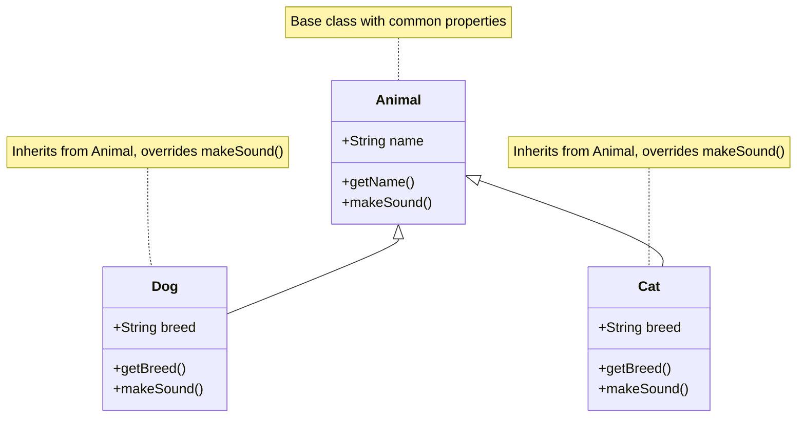
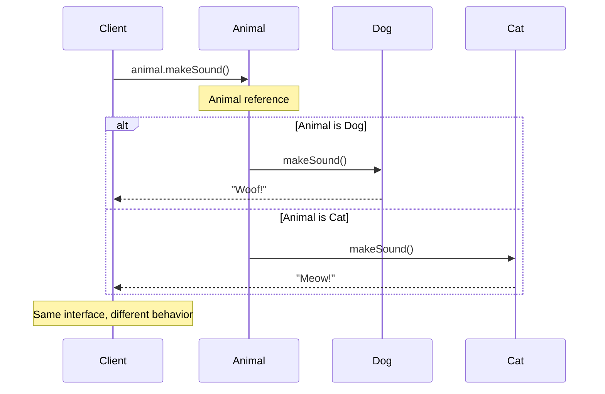

# Day 3: Object-Oriented Programming - Inheritance & Polymorphism

## Concept Explanation

Object-Oriented Programming (OOP) is a programming paradigm that organizes code into objects that contain data and code. Inheritance and polymorphism are two fundamental concepts that make OOP powerful and flexible.

### What is Inheritance?

**Inheritance** is a mechanism that allows a class to inherit properties and methods from another class. It promotes code reuse and establishes a relationship between classes.

#### Visual Representation of Inheritance



#### Visual Representation of Inheritance


#### Key Concepts:

1. **Base Class (Parent)**: The class being inherited from
2. **Derived Class (Child)**: The class that inherits
3. **Code Reuse**: Inherit common functionality
4. **Method Overriding**: Provide specific implementations

#### Benefits of Inheritance:

1. **Code Reuse**: Avoid duplicating common code
2. **Hierarchical Organization**: Logical class relationships
3. **Maintainability**: Changes in base class affect all derived classes
4. **Extensibility**: Easy to add new derived classes

### What is Polymorphism?

**Polymorphism** allows objects of different classes to be treated as objects of a common base class. It enables flexible and extensible code design.

#### Visual Representation of Polymorphism



#### Types of Polymorphism:

1. **Compile-time Polymorphism**: Method overloading
2. **Runtime Polymorphism**: Method overriding (dynamic dispatch)

#### Benefits of Polymorphism:

1. **Flexibility**: Handle different object types uniformly
2. **Extensibility**: Add new types without changing existing code
3. **Maintainability**: Easier to modify and extend systems

### Why Learn Inheritance & Polymorphism?

1. **Code Organization**: Better structure and readability
2. **Reusability**: Write once, use many times
3. **Maintainability**: Easier to modify and extend
4. **Real-world Modeling**: Natural way to model relationships
5. **Framework Development**: Essential for building extensible systems

## Exercise: Building a Class Hierarchy with Inheritance & Polymorphism

**Problem**: Create a simple class hierarchy that demonstrates inheritance relationships and polymorphic behavior.

**Learning Objectives**:
- Understand how inheritance works in practice
- Implement method overriding for polymorphic behavior
- Design clean class hierarchies
- Practice object-oriented design principles
- Learn when and how to use inheritance

**Requirements**:

### 1. Base Classes
Create these base classes:

- **Animal**: Base class with common properties and methods
- **Person**: Base class for human-like entities
- **Operation**: Base class for different types of operations

### 2. Derived Classes
Implement these derived classes:

- **Book**: Inherits from LibraryItem
- **Magazine**: Inherits from LibraryItem
- **DVD**: Inherits from LibraryItem
- **Member**: Inherits from Person
- **Librarian**: Inherits from Person
- **BorrowOperation**: Inherits from LibraryOperation
- **ReturnOperation**: Inherits from LibraryOperation

### 3. Required Methods
Each class should have:

- **Constructor**: Initialize object properties
- **Getter Methods**: Access object properties
- **Overridden Methods**: Demonstrate polymorphic behavior
- **Specific Methods**: Class-specific functionality

### 4. Polymorphic Behavior
Demonstrate:

- **Method Overriding**: Different implementations for different types
- **Runtime Polymorphism**: Same method call, different behavior
- **Type Checking**: Determine object types at runtime

### 5. Edge Cases to Handle
- Invalid data in constructors
- Null object references
- Type validation
- Error handling for invalid operations

## Expected Output

When you run your completed implementation, you should see output similar to this:

```
=== Day 3: Object-Oriented Programming - Inheritance & Polymorphism ===

Exercise: Building a Class Hierarchy for Library Management
=========================================================

Library System Initialization:
Creating library items...
Creating users...
Setting up operations...

Library Items Created:
- Book: "The Great Gatsby" by F. Scott Fitzgerald (Available)
- Magazine: "National Geographic" Issue 2024-01 (Available)
- DVD: "The Matrix" (1999) (Available)

Users Created:
- Member: John Doe (ID: M001, Status: Active)
- Librarian: Jane Smith (ID: L001, Level: Senior)

Demonstrating Inheritance & Polymorphism:

1. Displaying Item Information (Polymorphic):
Book Information:
  Title: The Great Gatsby
  Author: F. Scott Fitzgerald
  Type: Book
  Status: Available
  Fee: $0.50 per day

Magazine Information:
  Title: National Geographic
  Issue: 2024-01
  Type: Magazine
  Status: Available
  Fee: $0.25 per day

DVD Information:
  Title: The Matrix
  Year: 1999
  Type: DVD
  Status: Available
  Fee: $1.00 per day

2. Demonstrating Method Overriding:
Calculating fees for different items:
- Book (5 days): $2.50
- Magazine (3 days): $0.75
- DVD (2 days): $2.00

3. Demonstrating Polymorphic Operations:
Borrowing items:
- John Doe borrowing "The Great Gatsby": Success
- John Doe borrowing "National Geographic": Success
- John Doe borrowing "The Matrix": Success

Returning items:
- John Doe returning "The Great Gatsby": Success, Fee: $2.50
- John Doe returning "National Geographic": Success, Fee: $0.75
- John Doe returning "The Matrix": Success, Fee: $2.00

4. Demonstrating Access Control:
Librarian operations:
- Jane Smith can add new items: true
- Jane Smith can remove items: true
- Jane Smith can override fees: true

Member operations:
- John Doe can add new items: false
- John Doe can remove items: false
- John Doe can override fees: false

5. Error Handling:
Attempting invalid operations:
- Borrowing unavailable item: Error - Item not available
- Returning item not borrowed: Error - Item not borrowed by this user
- Invalid user operation: Error - Invalid user

Class Hierarchy Summary:
LibraryItem (Base)
├── Book
├── Magazine
└── DVD

Person (Base)
├── Member
└── Librarian

LibraryOperation (Base)
├── BorrowOperation
└── ReturnOperation

Polymorphism demonstrated:
- Different item types handled uniformly through base class references
- Method overriding provides specific behavior for each derived class
- Runtime type determination enables flexible operations
```

## Implementation Tips

### 1. Start with the Base Class
- Design the base class with common properties and methods
- Make methods abstract or provide default implementations
- Consider what should be accessible to derived classes

### 2. Implement Inheritance Gradually
- Create one derived class at a time
- Test each inheritance relationship individually
- Ensure proper constructor chaining

### 3. Focus on Polymorphism
- Override methods to provide specific behavior
- Use base class references to demonstrate polymorphic behavior
- Test with different object types

### 4. Handle Edge Cases
- Validate input data in constructors
- Check for null references before operations
- Provide meaningful error messages

## Learning Outcomes

By completing this exercise, you will:
- ✅ Understand inheritance relationships and hierarchies
- ✅ Implement method overriding for polymorphic behavior
- ✅ Design clean and maintainable class structures
- ✅ Practice object-oriented design principles
- ✅ Handle edge cases and error scenarios
- ✅ Build confidence in OOP concepts

## Next Steps

After completing this exercise:
- Try implementing interfaces for additional abstraction
- Add more complex inheritance hierarchies
- Implement design patterns that use inheritance
- Apply these concepts to real-world problems

## Additional Resources

- [Inheritance in Java](https://www.geeksforgeeks.org/inheritance-in-java/)
- [Polymorphism Guide](https://www.geeksforgeeks.org/polymorphism-in-java/)
- [OOP Principles](https://www.geeksforgeeks.org/object-oriented-programming-oops-concepts-in-java/)
- [Class Design Best Practices](https://www.geeksforgeeks.org/java-class-design/)
