# Day 4: Functional Programming - Higher-Order Functions

## Concept Explanation

Functional Programming is a programming paradigm that treats computation as the evaluation of mathematical functions and avoids changing state and mutable data. Understanding functional programming concepts helps you write more predictable, testable, and maintainable code.

### What are Higher-Order Functions?

**Higher-Order Functions** are functions that either take other functions as arguments or return functions as results. They enable powerful abstractions and make code more flexible and reusable.

#### Visual Representation of Higher-Order Functions

```mermaid
graph TD
    subgraph "Map Function"
        A1[Input Array: 1, 2, 3, 4, 5]
        A2[Callback: x * 2]
        A3[Output Array: 2, 4, 6, 8, 10]
        
        A1 --> A2 --> A3
    end
    
    subgraph "Filter Function"
        B1[Input Array: 1, 2, 3, 4, 5]
        B2[Callback: x % 2 === 0]
        B3[Output Array: 2, 4]
        
        B1 --> B2 --> B3
    end
    
    subgraph "Reduce Function"
        C1[Input Array: 1, 2, 3, 4, 5]
        C2[Callback: acc + x, Initial: 0]
        C3[Output: 15]
        
        C1 --> C2 --> C3
    end
    
    subgraph "Function Composition"
        D1[Original: 1, 2, 3, 4, 5]
        D2[Filter even: 2, 4]
        D3[Map double: 4, 8]
        D4[Reduce sum: 12]
        
        D1 --> D2 --> D3 --> D4
    end
```



#### Key Concepts:

1. **Functions as First-Class Citizens**: Functions can be assigned to variables, passed as arguments, and returned from other functions
2. **Pure Functions**: Functions that always return the same output for the same input and have no side effects
3. **Immutability**: Data cannot be changed after creation, promoting safer code

#### Common Higher-Order Functions:

1. **Map**: Transform each element in a collection
2. **Filter**: Select elements that meet certain criteria
3. **Reduce**: Combine all elements into a single value
4. **ForEach**: Perform an action on each element

### Why Learn Functional Programming?

1. **Code Reusability**: Functions can be combined and reused in different ways
2. **Predictability**: Pure functions are easier to test and debug
3. **Parallelization**: Immutable data makes parallel processing safer
4. **Modern Development**: Many frameworks and libraries use functional concepts

## Exercise: Build a Functional Programming Utility Library

**Problem**: Create a simple utility library with higher-order functions that demonstrate functional programming concepts.

**Learning Objectives**:
- Understand how functions can be passed as arguments
- Implement common higher-order functions
- Practice pure function design
- Learn functional programming patterns

**Requirements**:

### 1. Core Higher-Order Functions
Implement these essential functions:

- **map(array, callback)**: Transform each element using the callback function
- **filter(array, callback)**: Return elements that pass the callback test
- **reduce(array, callback, initialValue)**: Combine all elements into a single value
- **forEach(array, callback)**: Execute callback for each element

### 2. Callback Functions
Create simple callback functions to test your utilities:

- **Double numbers**: Multiply each number by 2
- **Filter even numbers**: Return only even numbers
- **Sum numbers**: Add all numbers together
- **Print elements**: Display each element

### 3. Data Processing
Use your functions to process sample data:

- Transform an array of numbers
- Filter data based on conditions
- Calculate totals and averages
- Display processed results

### 4. Edge Cases to Handle
- Empty arrays
- Single element arrays
- Arrays with different data types
- Invalid callback functions

## Expected Output

When you run your completed implementation, you should see output similar to this:

```
=== Day 4: Functional Programming - Higher-Order Functions ===

Exercise: Build a Functional Programming Utility Library
=====================================================

Sample Data:
Original array: [1, 2, 3, 4, 5, 6, 7, 8, 9, 10]

Testing Higher-Order Functions:

1. Map Function (Double all numbers):
Original: [1, 2, 3, 4, 5, 6, 7, 8, 9, 10]
Doubled: [2, 4, 6, 8, 10, 12, 14, 16, 18, 20]

2. Filter Function (Even numbers only):
Original: [1, 2, 3, 4, 5, 6, 7, 8, 9, 10]
Even numbers: [2, 4, 6, 8, 10]

3. Reduce Function (Sum all numbers):
Original: [1, 2, 3, 4, 5, 6, 7, 8, 9, 10]
Sum: 55

4. ForEach Function (Print each element):
Elements: 1, 2, 3, 4, 5, 6, 7, 8, 9, 10

Combining Functions:
Even numbers doubled: [4, 8, 12, 16, 20]
Sum of even numbers: 30
```

## Implementation Tips

### 1. Start Simple
- Begin with the map function (easiest to implement)
- Test each function individually before combining them
- Use simple callback functions initially

### 2. Focus on Function Design
- Make functions pure (same input = same output)
- Avoid modifying the original array
- Return new arrays/values instead of changing existing data

### 3. Test with Different Data
- Try with numbers, strings, and objects
- Test edge cases like empty arrays
- Verify that original data remains unchanged

## Learning Outcomes

By completing this exercise, you will:
- ✅ Understand how functions can be passed as arguments
- ✅ Implement common higher-order functions
- ✅ Practice pure function design
- ✅ Learn functional programming patterns
- ✅ See how functions can be combined and reused

## Next Steps

After completing this exercise:
- Try implementing other higher-order functions (find, some, every)
- Apply these concepts to real data processing tasks
- Explore functional programming libraries in your language
- Practice combining multiple functions for complex operations

## Additional Resources

- [Functional Programming Guide](https://www.geeksforgeeks.org/functional-programming-paradigm/)
- [Higher-Order Functions](https://www.geeksforgeeks.org/higher-order-functions-in-javascript/)
- [Pure Functions](https://www.geeksforgeeks.org/pure-functions-in-javascript/)
- [Array Methods](https://www.geeksforgeeks.org/javascript-array-methods/)
