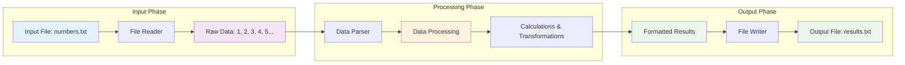

# Day 5: File I/O & Data Processing

## Concept Explanation

File Input/Output (I/O) operations are essential for reading data from files, processing it, and writing results back to files. Understanding file operations is crucial for building applications that work with real data.

### What is File I/O?

**File I/O** refers to reading data from files and writing data to files. It's how programs interact with the file system to store and retrieve information.

#### Visual Representation of File I/O Pipeline



#### Key Concepts:

1. **Reading Files**: Loading data from files into your program
2. **Writing Files**: Saving data from your program to files
3. **File Paths**: Understanding how to locate files in the file system
4. **File Formats**: Working with different file types (text, CSV, JSON)

#### Common File Operations:

1. **Open**: Establish connection to a file
2. **Read**: Get data from the file
3. **Write**: Put data into the file
4. **Close**: Properly close the file connection
5. **Error Handling**: Deal with file not found, permission issues, etc.

### Why Learn File I/O?

1. **Data Persistence**: Save program results for later use
2. **Data Import**: Load external data into your programs
3. **Configuration**: Read settings and preferences from files
4. **Logging**: Record program activities and errors
5. **Real Applications**: Most real-world programs need file operations

## Exercise: Build a Simple Data Processing Pipeline

**Problem**: Create a program that reads data from a file, processes it, and writes the results to a new file.

**Learning Objectives**:
- Understand basic file reading and writing operations
- Process data using simple transformations
- Handle file errors gracefully
- Build a complete data processing workflow

**Requirements**:

### 1. File Reading
- Read data from a text file
- Handle file not found errors
- Parse different data formats (numbers, text)

### 2. Data Processing
- Perform simple calculations (sum, average, count)
- Transform data (filter, sort, format)
- Handle different data types appropriately

### 3. File Writing
- Write processed results to a new file
- Format output in a readable way
- Handle write permission errors

### 4. Error Handling
- File not found scenarios
- Invalid data formats
- Permission issues
- Graceful error messages

## Expected Output

When you run your completed implementation, you should see output similar to this:

```
=== Day 5: File I/O & Data Processing ===

Exercise: Build a Simple Data Processing Pipeline
===============================================

Reading data from input file...
Data loaded successfully!

Processing data:
- Total numbers: 10
- Sum: 55
- Average: 5.5
- Even numbers: [2, 4, 6, 8, 10]
- Odd numbers: [1, 3, 5, 7, 9]

Writing results to output file...
Results saved successfully!

Summary:
- Input file: numbers.txt (10 lines)
- Output file: results.txt
- Processing completed successfully
```

## Implementation Tips

### 1. Start with File Reading
- Begin by reading a simple text file
- Test with a small file first
- Handle basic error cases

### 2. Focus on Simple Processing
- Start with basic calculations (sum, count)
- Add more complex operations gradually
- Test each processing step individually

### 3. Handle Errors Gracefully
- Always check if files exist
- Provide clear error messages
- Don't crash on file errors

## Learning Outcomes

By completing this exercise, you will:
- ✅ Understand basic file reading and writing operations
- ✅ Process data using simple transformations
- ✅ Handle file errors gracefully
- ✅ Build a complete data processing workflow
- ✅ Work with real file system operations

## Next Steps

After completing this exercise:
- Try working with different file formats (CSV, JSON)
- Add more complex data processing operations
- Implement file validation and data cleaning
- Explore database operations for larger datasets

## Additional Resources

- [File I/O Guide](https://www.geeksforgeeks.org/file-handling-in-java/)
- [Data Processing](https://www.geeksforgeeks.org/data-processing-in-java/)
- [Error Handling](https://www.geeksforgeeks.org/exception-handling-in-java/)
- [File Operations](https://www.geeksforgeeks.org/file-operations-in-java/)
